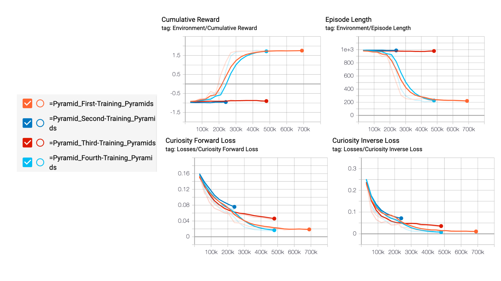

# Chapter 2: Pyramids

The article is not published yet 🚧

You can see the agent performing after 700,000 training timesteps [here](https://www.youtube.com/watch?v=Ab2fHTMGf50).

## How to

- Move your model file into `UnitySDK/Assets/ML-Agents/Examples/Pyramids/TFModels`.
- Open the Unity Editor, and select `Pyramids` scene.
- Select the `AreaPB` prefab object and open it.
- Select `Agent`.
- In Agent `Behavior Parameters`, drag the `Pyramids.nn` file to `Model` Placeholder.
- Press the ▶️ button at the top of the Editor.
- Enjoy !

## The different saved models

As explained in the article, I tried 4 differents training configurations.

- `First Training [BEST]`: PPO with default configuration provided by Unity.
- `Second Training`: Missing 
- `Third Training`: PPO with gamma 0.95 for extrinsic reward 
- `Fourth Training`: PPO with time horizon = 256.  

--> The best result is the `First Training`.

